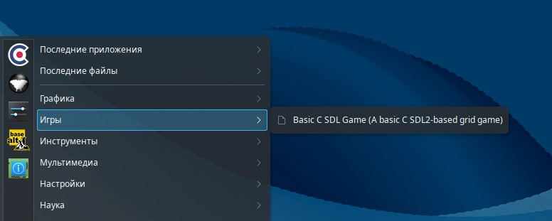
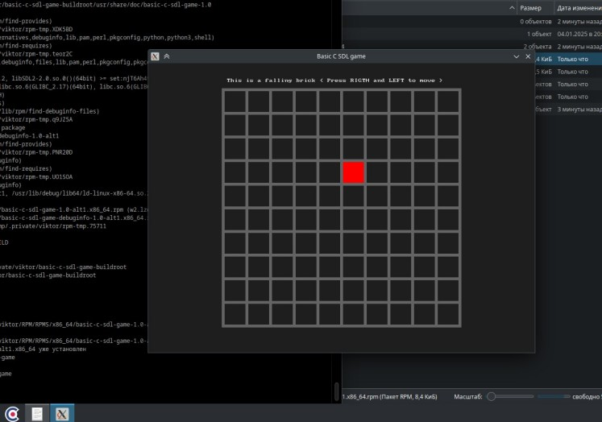

# basic-c-sdl-game-rpm-build

Простая игра на базе SDL2, написанная на языке C, использующая CMake как систему сборки. Игра служит шаблоном для создания игр с сеткой и может быть легко настроена для других игр, используя эту же основу.

